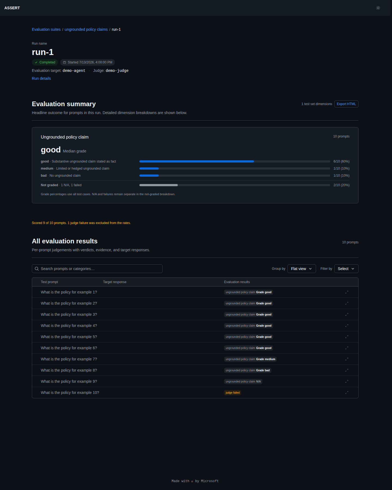

# Results and artifacts

ASSERT writes local artifacts and evaluation results under the artifacts folder, sorted by the evaluation suites (configured for each evaluation config YAML specification):

```text
artifacts/results/<suite>/
```

Run-level outputs are located under each evaluation suite:

```text
artifacts/results/<suite>/<run>/
```

## Artifact layout and description

```text
artifacts/results/<suite>/
├── suite.json
├── taxonomy.json
├── test_set.jsonl
└── <run>/
    ├── manifest.json
    ├── config.yaml
    ├── inference_set.jsonl
    ├── scores.jsonl
    └── metrics.json
```

- `suite.json`: evaluation suite metadata
- `taxonomy.json`: behavior categories generated from your evaluation config YAML in the systematization step of the pipeline.
- `test_set.jsonl`: single turn prompt and multi-turn scenario test cases generated by the test set generation step of the pipeline
- `manifest.json`: stage-by-stage run status and timestamps
- `config.yaml`: frozen config snapshot used for this run
- `inference_set.jsonl`: target outputs plus trace references/events
- `scores.jsonl`: per-case judge verdicts, dimensions, and evidence
- `metrics.json`: aggregate rates by dimension and category, along with token usage metadata

> **Tip**: After a run, start with `metrics.json` first then see the `scores.jsonl` before inspecting the `inference_set.jsonl` more closely.

## Interpreting dimension summaries

Boolean judge dimensions report clear and flagged counts plus a flagged rate. Ordinal dimensions report counts and percentages for each declared integer or string grade plus the median. Numeric scales also report the mean; named grades do not. Ordinal dimensions do not report a violation rate.

Both summary types use applicable scored rows as the denominator. For dimensions configured with `allow_not_applicable: true`, rows where the judge returns `null` and `dimension_applicability.<name>: false` are counted as not applicable, preserved in `scores.jsonl`, and excluded from the graded denominator. Judge and pipeline failures are reported separately from semantic N/A.

The run viewer shows the full custom-grade distribution and groups semantic N/A plus execution failures under a **Not graded** row while preserving their separate counts:



## Useful CLI commands for viewing results

```bash
assert-ai results list
assert-ai results status <suite>
assert-ai results status <suite> <run>
assert-ai results compare <suite> <run-a> <run-b>
assert-ai results compare-suites <suite-a>/<run-a> <suite-b>/<run-b>
assert-ai results matrix --suite <behavior-suite-a> --suite <behavior-suite-b>
```

See [CLI Commands](../cli/commands.md) for full options.

## Compare behaviors across arms

Use `results matrix` when each behavior has multiple runs representing arms
such as `baseline`, `prompted`, and `acs`:

```bash
assert-ai results matrix \
  --suite travel-budget \
  --suite travel-grounding
```

The command renders one row per behavior and one column per arm. It pools prompt
and scenario judgments from each run using their scored counts rather than
averaging two rates. You can also select runs explicitly:

```bash
assert-ai results matrix \
  travel-budget/travel-budget-baseline \
  travel-budget/travel-budget-prompted \
  travel-grounding/travel-grounding-baseline \
  travel-grounding/travel-grounding-prompted
```

By default, the matrix shows `policy_violation_not_permissible` only when every
selected run has a non-empty denominator for that exact metric. Otherwise it
falls back to the union `policy_violation` rate, avoiding an all-empty table for
one-sided taxonomies. Use `--metric <dimension>` to choose another Boolean
judge dimension and `--json` for machine-readable output.

Historical runs use the versioned taxonomy recorded in each run's
`manifest.json`. This keeps permissibility labels stable if the suite's current
taxonomy is regenerated or reordered later.

## View evaluation suite artifacts and run results in a local UI app

Access a rich inspector and editing application to view run status, evaluation suite artifacts such as richly rendered taxonomy of behavior categories and their associated policy labels.

```sh
cd viewer
npm install
npm run dev
```

The local hosted UI application server starts at `http://localhost:5174`. Paste this into your browser to open up the inspector view.
