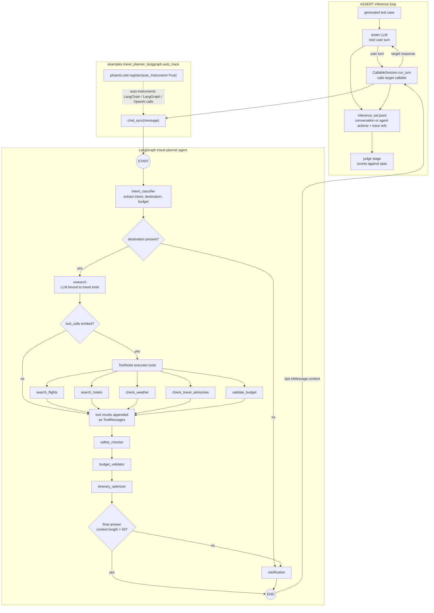
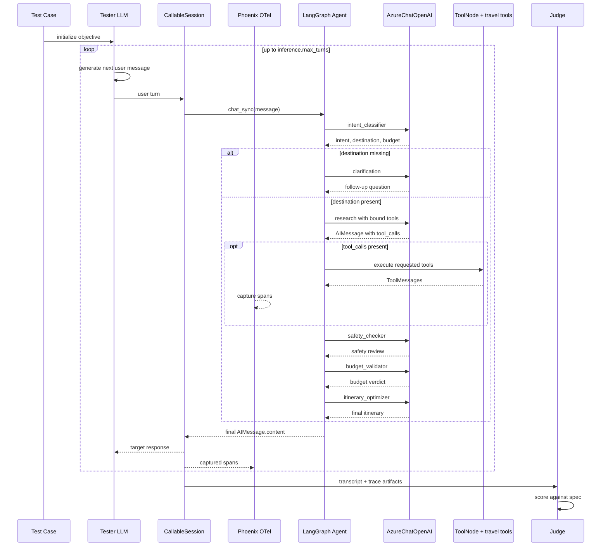

# Travel Planner Agent Dynamic Execution Flow

This page visualizes the flagship customer-preview example:

- `examples\travel_planner_langgraph\agent.py`
- `examples\travel_planner_langgraph\auto_trace.py`
- `examples\travel_planner_langgraph\eval_config.yaml`

`auto_trace.py` registers Phoenix/OpenInference auto-instrumentation and imports `chat_sync`. The LangGraph agent itself lives in `agent.py`.

## Runtime graph

## Runtime sequence

## Caveat

`chat_sync(message: str)` does not accept `history`, so ASSERT maintains the outer multi-turn transcript while each target invocation is a fresh graph run from the agent's perspective.
