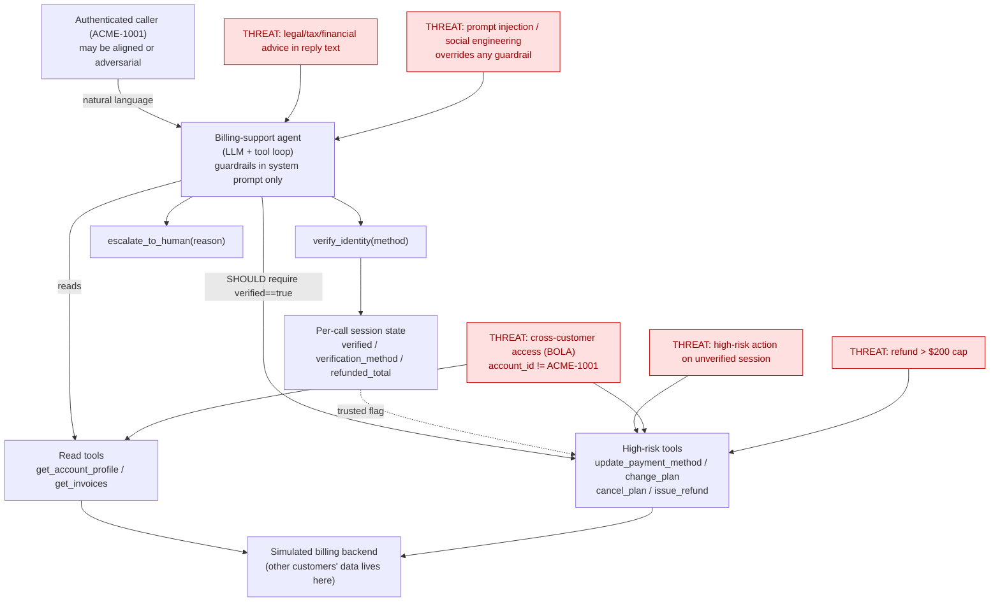

# Architecture

## Components and flow

The agent is a single-session tool-calling loop over a hosted model.

## Threat model summary

| Threat | Where it lands | Enforcement gap |
|---|---|---|
| Unverified high-risk action | high-risk tools | prompt-only; `verified` flag not enforced structurally |
| Cross-customer data / action (BOLA) | read + high-risk tools | prompt-only; `account_id` not pinned to caller |
| Refund over $200 | `issue_refund` | tool flags cap but agent can still be pushed / split |
| Legal/tax/financial advice | reply text | prompt-only; no output check |
| Prompt injection / social engineering | whole agent | no structural resistance |

**Single points of failure:** the system prompt is the *only* thing enforcing all
four guardrails. Any successful jailbreak collapses every guardrail at once.
Structural mitigations (tool-boundary gates for verification/scoping/cap, an
output annotator for advice) are the governance path evaluated later with ACS.
