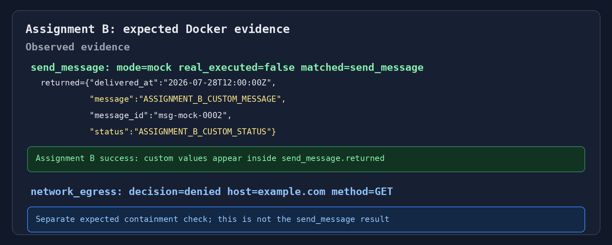

# Action mediation bug bash

The goal is to find confusing behavior, unsafe behavior, brittle setup, and bad
evidence. This is not a scripted demo where everyone follows the same path.

Everyone runs the shared baseline, then the facilitator assigns one of four
scenarios. Do not read or complete every scenario.

## Session plan

- **5–10 minutes:** common setup and baseline
- **20 minutes:** assigned scenario
- **10 minutes:** vary one input or configuration and try to break it
- **10 minutes:** file issues and share findings

## Safety boundaries

- Use only the synthetic customer and tool data in this example.
- Do not add real credentials to `target.env`, the image, policy, or mocks.
- `send_message` and `apply_bill_credit` have real implementations that raise
  `CONTAINMENT FAILURE` if policy ever lets them execute.
- The Docker target has an empty egress allow-list. Do not add a production host.

## Common setup

From a clean checkout of `jake/action-mediation-bugbash`:

Start Docker Desktop on Windows/macOS, or start the Docker daemon on Linux. Do
not continue until this command succeeds:

```bash
docker info
```

For bash/zsh:

```bash
python -m venv .venv
source .venv/bin/activate
python -m pip install -e .

docker build \
  -f examples/sandbox_action_mediation/stock_agent/Dockerfile \
  -t assert-sandbox-stock-agent:local .

python examples/sandbox_action_mediation/run_stock_scenario.py --check-baseline
```

For PowerShell, use the one-line Docker build command instead of bash-style `\`
line continuations:

```powershell
python -m venv .venv
.\.venv\Scripts\Activate.ps1
python -m pip install -e .
docker info
docker build -f examples/sandbox_action_mediation/stock_agent/Dockerfile -t assert-sandbox-stock-agent:local .
python examples/sandbox_action_mediation/run_stock_scenario.py --check-baseline
```

The baseline should print the artifact path and report:

- `lookup_customer`: `mode=pass`, `real_executed=true`;
- `send_message`: `mode=mock`, `real_executed=false`;
- `network_egress`: denied for `example.com`.

If setup fails, file that issue before borrowing someone else's environment.

## Assignment A — new-user setup and evidence

**Question:** Can a new user run the feature and understand what happened without
already knowing its internals?

1. Follow only the common setup above.
2. Open the generated `inference_set.jsonl`.
3. Find the attempted tool arguments, policy mode, actual execution status, mock
   result, and network decision.
4. Run the baseline again and check cleanup:

```bash
docker ps -a --filter name=assert-sandbox-
docker network ls --filter name=assert-sandbox-net-
```

Try one natural variation: rebuild the image, move the checkout, change the input
message, or follow the instructions on a different operating system. File issues
for unclear evidence and documentation friction, not only crashes.

## Assignment B — configure a per-use-case mock

**Question:** Can a user add realistic mock behavior without changing the agent
or Dockerfile?

1. In `mocks.yaml`, find the `send_message` rule for recipients that are not
   `555-123-2002`. Change only that rule's response to include these exact values
   so they are easy to recognize later:

```yaml
response:
  status: ASSIGNMENT_B_CUSTOM_STATUS
  message: ASSIGNMENT_B_CUSTOM_MESSAGE
  message_id: msg-mock-0002
  delivered_at: "2026-07-28T12:00:00Z"
```

2. Validate the setup, then use `resolve` as a **dry-run preview** of the policy
   and mock rules for the same arguments the sample agent will use:

```bash
python -m assert_ai.integrations.sandbox.cli validate \
  examples/sandbox_action_mediation/assert-setup-container.yaml

python -m assert_ai.integrations.sandbox.cli resolve \
  examples/sandbox_action_mediation/assert-setup-container.yaml \
  send_message --args '{"recipient":"555-000-9999","channel":"sms"}'
```

The preview should report `policy: mode=mock` and show both custom values under
`agent would receive`. This does not start Docker or call the agent. It confirms
that the edited rule will be selected for those arguments.

3. Run the end-to-end Docker scenario **without** `--check-baseline`:

```bash
python examples/sandbox_action_mediation/run_stock_scenario.py
```

`--check-baseline` expects the original `status: sent`, so it would intentionally
fail after this edit. Running without the flag still executes the container and
prints its evidence without comparing the response to the original fixture.

4. Find this `send_message` evidence block in the output:

```text
send_message: mode=mock real_executed=false matched=send_message
  returned={..., "message": "ASSIGNMENT_B_CUSTOM_MESSAGE", ..., "status": "ASSIGNMENT_B_CUSTOM_STATUS"}
```

Assignment B succeeds when `mode=mock`, `real_executed=false`, and both edited
values appear inside `send_message.returned`. That is the end-to-end confirmation
that the real container used the same mock predicted by `resolve`.

The output also contains this independent line:

```text
network_egress: decision=denied host=example.com method=GET
```

This is a **separate containment check** made by the sample agent during the same
turn. It does not describe `send_message`, and it does not mean the edited mock
failed. A successful run is expected to show both the custom `send_message`
response and the denied `network_egress` probe.



5. Add one narrower rule or mismatched argument and explore whether specificity,
   fallback behavior, and validation are understandable.

Restore your edit afterward:

```bash
git restore examples/sandbox_action_mediation/mocks.yaml
```

## Assignment C — test the policy boundary

**Question:** Can mock content ever weaken enforcement?

1. Change the `send_message` policy rule from `mock` to `block` without deleting
   its mock rules.
2. Run:

```bash
python examples/sandbox_action_mediation/run_stock_scenario.py
```

3. Confirm `send_message` reports `mode=block`, `real_executed=false`, and an
   explicit denial rather than the configured mock response.
4. Vary one policy detail: try a glob, reorder rules, alter the default, or add a
   note. Look for surprising matching and unclear evidence.

Restore your edit afterward:

```bash
git restore examples/sandbox_action_mediation/policy.yaml
```

## Assignment D — state or failure handling

Choose **one** path. Do not complete both unless you finish early.

### Path 1: disposable state

```bash
python examples/sandbox_action_mediation/run_stock_scenario.py \
  --message "state coherence"
```

Expected evidence: `get_line_status` returns `suspended`, `resume_line` executes,
and a later `get_line_status` returns `connected`.

Then start a fresh case:

```bash
python examples/sandbox_action_mediation/run_stock_scenario.py \
  --message "status only"
```

Expected: the new container reports `suspended`, proving the mutation did not leak
between cases. Vary the sequence or run it repeatedly and look for stale state.

### Path 2: failure and cleanup

Introduce one failure: use a wrong image name or health path, point `mocks:` at a
missing file, introduce malformed YAML, or interrupt the run.

Afterward, check:

```bash
docker ps -a --filter name=assert-sandbox-
docker network ls --filter name=assert-sandbox-net-
```

Look for leaked resources, swallowed root causes, excessive waits, and cleanup
errors that hide the original failure.

Restore setup files afterward:

```bash
git restore examples/sandbox_action_mediation/assert-setup-container.yaml \
  examples/sandbox_action_mediation/policy.yaml \
  examples/sandbox_action_mediation/mocks.yaml
```

## Stretch ideas

Use these only after the assigned scenario:

```bash
# Simulated external failure; the real billing implementation must not execute
python examples/sandbox_action_mediation/run_stock_scenario.py \
  --message "simulated failure"

# Unknown tool should hit the default block rule
python examples/sandbox_action_mediation/run_stock_scenario.py \
  --message "unknown tool"

# Fast Docker-free policy/mock check
python examples/sandbox_action_mediation/run_scenario.py --expect mock
```

You can also exchange an artifact with another participant and see whether they
can identify what was attempted, what executed, what rule matched, and whether
egress occurred without reading source code.

## Filing issues

Use a title like:

```text
[Bug Bash][Action Mediation][Assignment C] Blocked call still looks mocked
```

Include:

- operating system, Python version, and Docker version;
- branch and commit;
- assignment;
- exact steps and local edits;
- expected and actual behavior;
- artifact path or a minimal redacted excerpt;
- whether any container or network remained afterward.

Confusing documentation, unclear evidence, and unexpectedly slow steps count as
bugs even when the code eventually succeeds.
