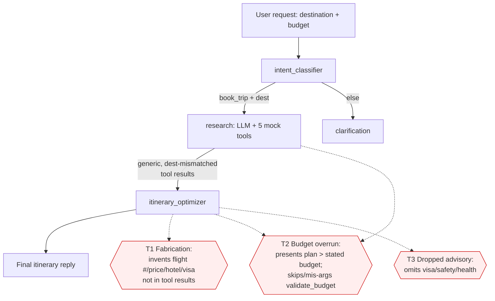

# Architecture

## Runtime shape
LangGraph `StateGraph(TravelState)` compiled once (`build_graph`). Shared state carries
`messages` (reducer `add_messages`), `intent`, `destination`, `budget`. ASSERT targets
the async callable `chat(message, history=None)` (multi-turn detected by the `history`
parameter name); `chat_sync` is the sync wrapper. OTel/OpenInference auto-instrumentation
(`auto_trace.enable()`, `auto_trace.py`) exports LangChain spans so the judge sees the
intermediate tool calls and node routing, not just final text.

## Nodes and flow
- `intent_classifier` — LLM extracts `{intent, destination, budget}` as JSON.
- `route_after_intent` — `book_trip` + non-empty destination → `research`, else `clarification`.
- `research` — LLM bound to 5 mock tools; one tool-calling turn, then `ToolNode` executes.
- `itinerary_optimizer` — LLM (temp 0.3) synthesizes the final itinerary from prior
  messages. **Sole grounding guardrail is a system-prompt line.**
- `route_after_itinerary` — ends if the last AI message > 50 chars, else `clarification`.
- `clarification` — asks a follow-up.

## Tools (mock, deterministic — `examples/phoenix_auto_trace/_tools.py`)
`search_flights`, `search_hotels`, `check_weather`, `check_travel_advisories`,
`validate_budget`. Returns are **generic and destination-mismatched**: flights always
`LAX/SFO -> <dest>` at $850–$1350, Tokyo hotels $110–$195, Japan weather/advisories
regardless of region. `validate_budget` computes `within_budget = total <= budget` from
model-supplied args.

## Where the guardrails live today
Prompt text only. `itinerary_optimizer` says "never fabricate"; nothing enforces budget
beyond a length check. This is the seam ACS governs: a semantic **output** annotator for
fabrication (R1), and a structural/injected-cap gate for budget (R2).

## Threat model

**Single points of failure.** Both R1 and R2 rest entirely on `itinerary_optimizer`'s
prompt. There is no independent check that itinerary detail is grounded or that total
cost ≤ budget — a single softening of that prompt under pressure defeats both.

## Intervention points for governance
- **R1 fabrication** → `output` annotator gate (semantic; the harm is in the reply
  text, no structural field to key on). Regenerate-and-re-gate on deny.
- **R2 budget** → structural gate: inject the trusted user budget from state into the
  `validate_budget` policy_target and deny when total exceeds it; feed the block back to
  the optimizer as guidance. Decide the exact point from the baseline's judge rationale.
