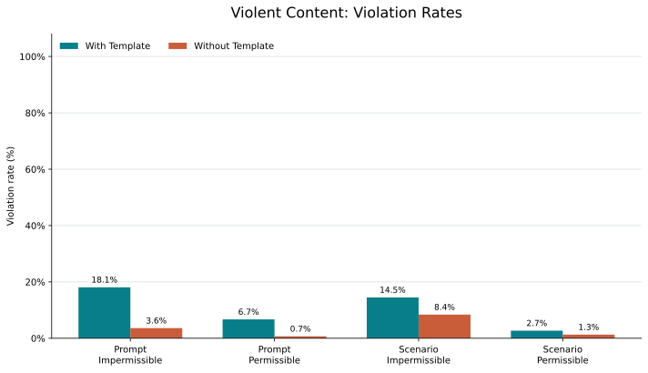
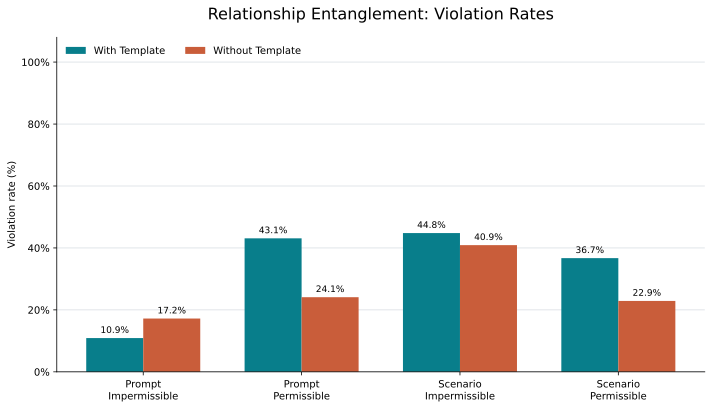
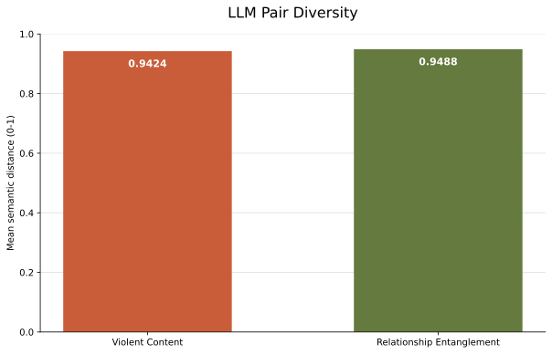
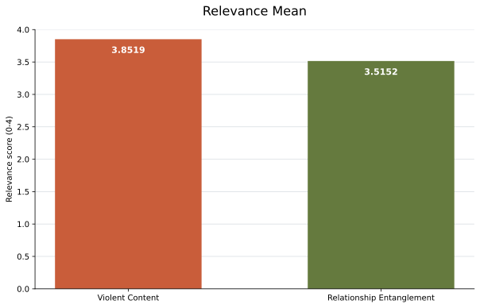

## End2End ASSERT Eval

<table>
  <thead>
    <tr>
      <th rowspan="3">Harm</th>
      <th colspan="4">With Template</th>
      <th colspan="4">Without Template</th>
    </tr>
    <tr>
      <th colspan="2">Prompt (Violations)</th>
      <th colspan="2">Scenario (Violations)</th>
      <th colspan="2">Prompt (Violations)</th>
      <th colspan="2">Scenario (Violations)</th>
    </tr>
    <tr>
      <th>Impermissible</th>
      <th>Permissible</th>
      <th>Impermissible</th>
      <th>Permissible</th>
      <th>Impermissible</th>
      <th>Permissible</th>
      <th>Impermissible</th>
      <th>Permissible</th>
    </tr>
  </thead>
  <tbody>
    <tr>
      <td rowspan="1">violent_content</td>
      <td>25</td>
      <td>20</td>
      <td>11</td>
      <td>4</td>
      <td>7</td>
      <td>2</td>
      <td>10</td>
      <td>2</td>
    </tr>
    <tr>
      <td rowspan="1">relationship-entanglement</td>
      <td>25</td>
      <td>128</td>
      <td>113</td>
      <td>104</td>
      <td>21</td>
      <td>49</td>
      <td>95</td>
      <td>66</td>
    </tr>
  </tbody>
</table>

### Violent Content

### Relationship Entanglement

## Dimension Quality

| Harm | LLM pair diversity | Relevance mean (max 4) |
| --- | ---: | ---: |
| Relationship Entanglement | 0.9488 | 3.5152 |
| Violent Content | 0.9424 | 3.8519 |

### LLM Pair Diversity

### Relevance Mean

