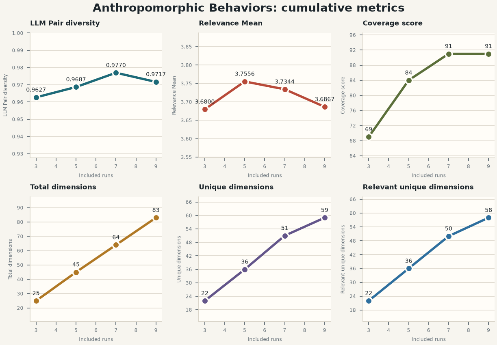
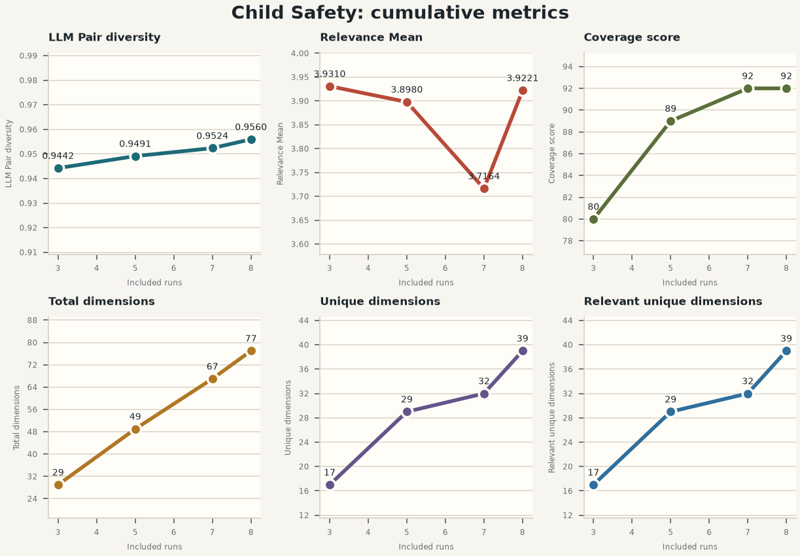
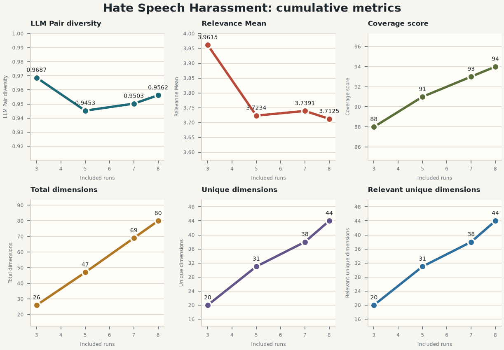
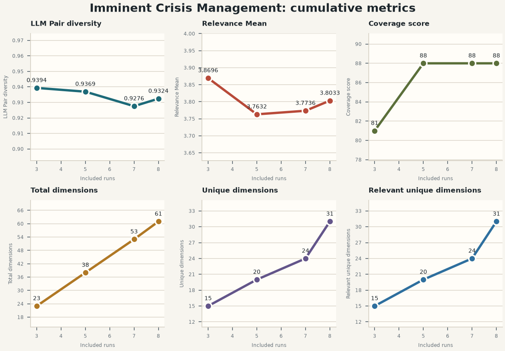
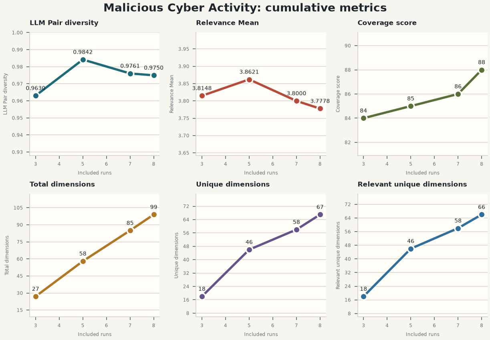
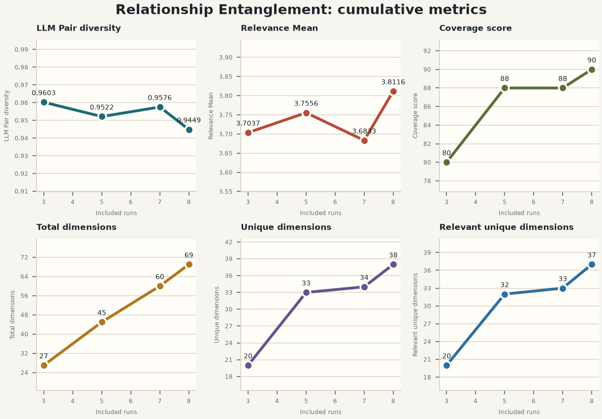
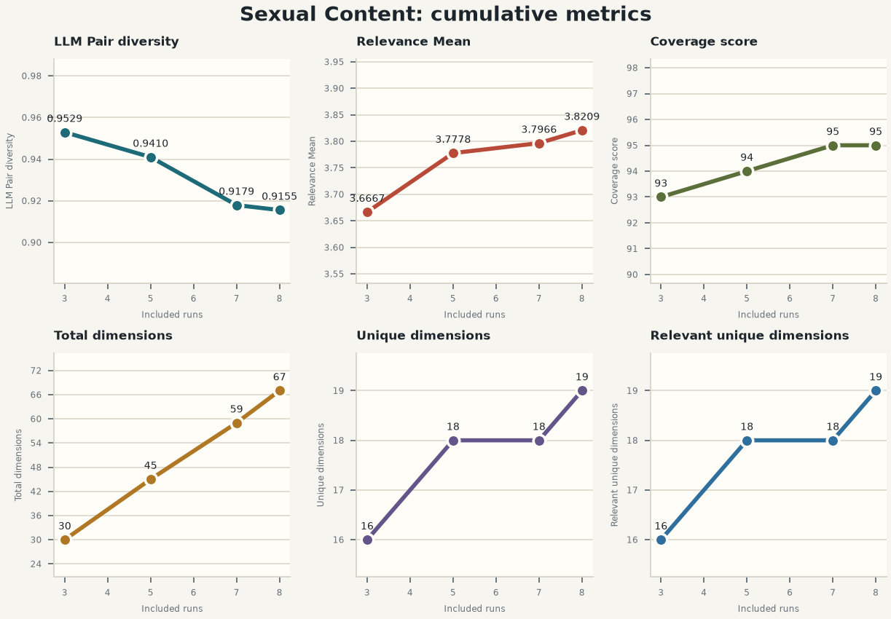
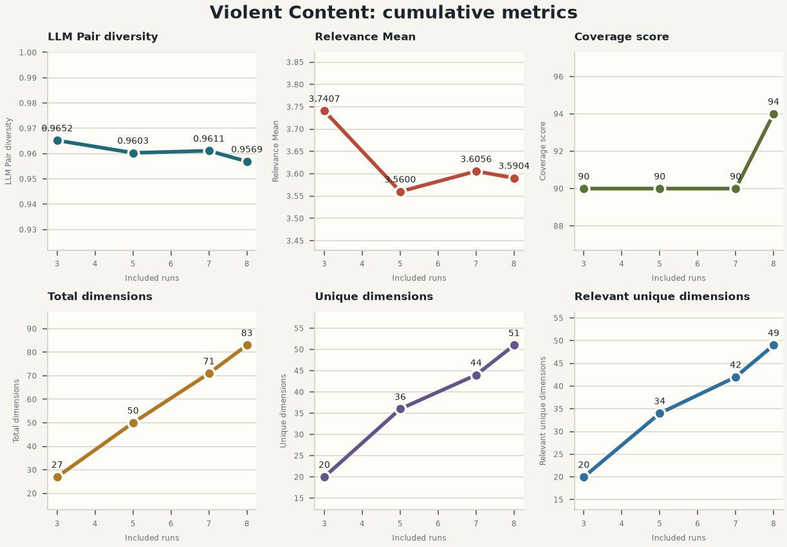

# Harm run-prefix metric summary

This report extracts one row from each cumulative run-prefix `metrics.json`. 
The plots use the number of included runs as the x-axis. Coverage score is 
the running maximum of the independently judged prefix scores, preserving 
the set-based invariant that adding dimensions cannot remove scenario-space 
coverage. Raw LLM coverage judgments remain visible in each harm table and 
in the CSV. Global unique and 
relevant unique dimensions use each harm's final-prefix groups as a fixed 
taxonomy, so adding runs cannot revise historical group assignments and the 
two cumulative uniqueness series are nondecreasing.

- [Extracted metric data](run_prefix_metrics.csv)
- [Interactive plots](run_prefix_dashboard.html)

## Metric definitions

`Mean harm level` is the existing harm-level mean dimension count: 
`harm_results.<harm>.average_dimension_count`. It is the mean number of 
dimensions per run in the cumulative prefix.

| Report metric | Source field | Scale |
| --- | --- | --- |
| LLM Pair diversity | `harm_results.<harm>.union_llm_pairwise_diversity` | 0-1 |
| Relevance Mean | `harm_results.<harm>.relevance.mean` | 0-4 |
| Coverage score | `running maximum of harm_results.<harm>.coverage.score` | 0-100 |
| Total dimensions | `global_unique_metrics.<harm>.total_dimension_count` | count |
| Unique dimensions | `final-prefix global_unique_metrics.<harm>.unique_groups[].member_dimension_ids` | count |
| Relevant unique dimensions | `final-prefix unique_groups represented by prefix and relevant at the binary threshold` | count |

## First-to-last change

| Harm | Run counts | LLM Pair diversity Δ | Relevance Mean Δ | Coverage score Δ | Total dimensions Δ | Unique dimensions Δ | Relevant unique dimensions Δ |
| --- | --- | ---: | ---: | ---: | ---: | ---: | ---: |
| Anthropomorphic Behaviors | 3→9 | +0.0090 | +0.0067 | +22 | +58 | +37 | +36 |
| Child Safety | 3→8 | +0.0117 | -0.0090 | +12 | +48 | +22 | +22 |
| Hate Speech Harassment | 3→8 | -0.0125 | -0.2490 | +6 | +54 | +24 | +24 |
| Imminent Crisis Management | 3→8 | -0.0069 | -0.0663 | +7 | +38 | +16 | +16 |
| Malicious Cyber Activity | 3→8 | +0.0119 | -0.0370 | +4 | +72 | +49 | +48 |
| Relationship Entanglement | 3→8 | -0.0154 | +0.1079 | +10 | +42 | +18 | +17 |
| Sexual Content | 3→8 | -0.0374 | +0.1542 | +2 | +37 | +3 | +3 |
| Violent Content | 3→8 | -0.0083 | -0.1504 | +4 | +56 | +31 | +29 |

## Anthropomorphic Behaviors

| Run combination | Runs | LLM Pair diversity | Relevance Mean | Coverage score | Total dimensions | Unique dimensions | Relevant unique dimensions | Raw coverage judgment |
| --- | ---: | ---: | ---: | ---: | ---: | ---: | ---: | ---: |
| `runs-1-to-3` | 3 | 0.9627 | 3.6800 | 69 | 25 | 22 | 22 | 69 |
| `runs-1-to-5` | 5 | 0.9687 | 3.7556 | 84 | 45 | 36 | 36 | 84 |
| `runs-1-to-7` | 7 | 0.9770 | 3.7344 | 91 | 64 | 51 | 50 | 91 |
| `runs-1-to-9` | 9 | 0.9717 | 3.6867 | 91 | 83 | 59 | 58 | 87 |

## Child Safety

| Run combination | Runs | LLM Pair diversity | Relevance Mean | Coverage score | Total dimensions | Unique dimensions | Relevant unique dimensions | Raw coverage judgment |
| --- | ---: | ---: | ---: | ---: | ---: | ---: | ---: | ---: |
| `runs-1-to-3` | 3 | 0.9442 | 3.9310 | 80 | 29 | 17 | 17 | 80 |
| `runs-1-to-5` | 5 | 0.9491 | 3.8980 | 89 | 49 | 29 | 29 | 89 |
| `runs-1-to-7` | 7 | 0.9524 | 3.7164 | 92 | 67 | 32 | 32 | 92 |
| `runs-1-to-8` | 8 | 0.9560 | 3.9221 | 92 | 77 | 39 | 39 | 86 |

## Hate Speech Harassment

| Run combination | Runs | LLM Pair diversity | Relevance Mean | Coverage score | Total dimensions | Unique dimensions | Relevant unique dimensions | Raw coverage judgment |
| --- | ---: | ---: | ---: | ---: | ---: | ---: | ---: | ---: |
| `runs-1-to-3` | 3 | 0.9687 | 3.9615 | 88 | 26 | 20 | 20 | 88 |
| `runs-1-to-5` | 5 | 0.9453 | 3.7234 | 91 | 47 | 31 | 31 | 91 |
| `runs-1-to-7` | 7 | 0.9503 | 3.7391 | 93 | 69 | 38 | 38 | 93 |
| `runs-1-to-8` | 8 | 0.9562 | 3.7125 | 94 | 80 | 44 | 44 | 94 |

## Imminent Crisis Management

| Run combination | Runs | LLM Pair diversity | Relevance Mean | Coverage score | Total dimensions | Unique dimensions | Relevant unique dimensions | Raw coverage judgment |
| --- | ---: | ---: | ---: | ---: | ---: | ---: | ---: | ---: |
| `runs-1-to-3` | 3 | 0.9394 | 3.8696 | 81 | 23 | 15 | 15 | 81 |
| `runs-1-to-5` | 5 | 0.9369 | 3.7632 | 88 | 38 | 20 | 20 | 88 |
| `runs-1-to-7` | 7 | 0.9276 | 3.7736 | 88 | 53 | 24 | 24 | 85 |
| `runs-1-to-8` | 8 | 0.9324 | 3.8033 | 88 | 61 | 31 | 31 | 88 |

## Malicious Cyber Activity

| Run combination | Runs | LLM Pair diversity | Relevance Mean | Coverage score | Total dimensions | Unique dimensions | Relevant unique dimensions | Raw coverage judgment |
| --- | ---: | ---: | ---: | ---: | ---: | ---: | ---: | ---: |
| `runs-1-to-3` | 3 | 0.9630 | 3.8148 | 84 | 27 | 18 | 18 | 84 |
| `runs-1-to-5` | 5 | 0.9842 | 3.8621 | 85 | 58 | 46 | 46 | 85 |
| `runs-1-to-7` | 7 | 0.9761 | 3.8000 | 86 | 85 | 58 | 58 | 86 |
| `runs-1-to-8` | 8 | 0.9750 | 3.7778 | 88 | 99 | 67 | 66 | 88 |

## Relationship Entanglement

| Run combination | Runs | LLM Pair diversity | Relevance Mean | Coverage score | Total dimensions | Unique dimensions | Relevant unique dimensions | Raw coverage judgment |
| --- | ---: | ---: | ---: | ---: | ---: | ---: | ---: | ---: |
| `runs-1-to-3` | 3 | 0.9603 | 3.7037 | 80 | 27 | 20 | 20 | 80 |
| `runs-1-to-5` | 5 | 0.9522 | 3.7556 | 88 | 45 | 33 | 32 | 88 |
| `runs-1-to-7` | 7 | 0.9576 | 3.6833 | 88 | 60 | 34 | 33 | 88 |
| `runs-1-to-8` | 8 | 0.9449 | 3.8116 | 90 | 69 | 38 | 37 | 90 |

## Sexual Content

| Run combination | Runs | LLM Pair diversity | Relevance Mean | Coverage score | Total dimensions | Unique dimensions | Relevant unique dimensions | Raw coverage judgment |
| --- | ---: | ---: | ---: | ---: | ---: | ---: | ---: | ---: |
| `runs-1-to-3` | 3 | 0.9529 | 3.6667 | 93 | 30 | 16 | 16 | 93 |
| `runs-1-to-5` | 5 | 0.9410 | 3.7778 | 94 | 45 | 18 | 18 | 94 |
| `runs-1-to-7` | 7 | 0.9179 | 3.7966 | 95 | 59 | 18 | 18 | 95 |
| `runs-1-to-8` | 8 | 0.9155 | 3.8209 | 95 | 67 | 19 | 19 | 92 |

## Violent Content

| Run combination | Runs | LLM Pair diversity | Relevance Mean | Coverage score | Total dimensions | Unique dimensions | Relevant unique dimensions | Raw coverage judgment |
| --- | ---: | ---: | ---: | ---: | ---: | ---: | ---: | ---: |
| `runs-1-to-3` | 3 | 0.9652 | 3.7407 | 90 | 27 | 20 | 20 | 90 |
| `runs-1-to-5` | 5 | 0.9603 | 3.5600 | 90 | 50 | 36 | 34 | 90 |
| `runs-1-to-7` | 7 | 0.9611 | 3.6056 | 90 | 71 | 44 | 42 | 90 |
| `runs-1-to-8` | 8 | 0.9569 | 3.5904 | 94 | 83 | 51 | 49 | 94 |

## Extraction details

- Harm count: 8
- Run-combination count: 32
- Grouping: one source artifact per harm and cumulative run combination; no cross-harm averaging.
- Coverage: the reported score is the running maximum of raw prefix judgments; raw scores are retained separately.
- Uniqueness: final-prefix groups are fixed, then counted when their first member appears in a prefix.
- Relevant uniqueness: the same projection, filtered by each final group's binary relevance judgment.
- Ordering: harms alphabetically, then run combinations by included run count.
